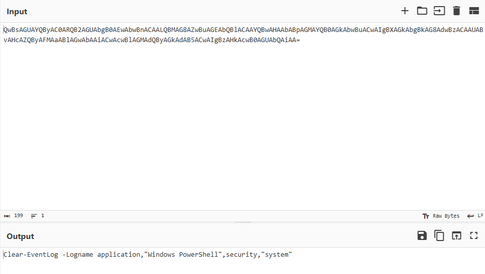
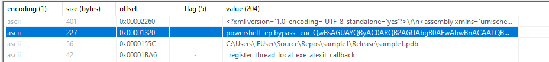
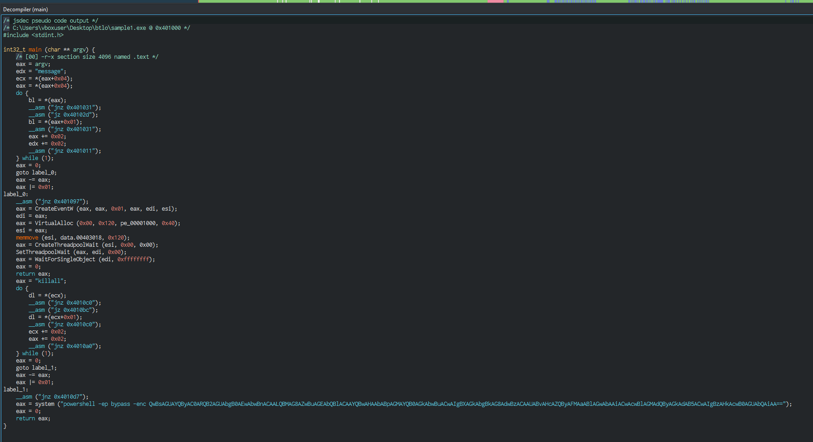

## Scenario
> [Analyze the attached EXE sample and find answers to the following.
Note: The EXE uses shellcode generated using Metasploit. Make sure you analyze the sample in contained environment.]

## Objective
Statically analyze a PE sample to determine how it allocates memory, runs shellcode, and abuses PowerShell — without executing it.

## Tools Used
- PEstudio
- Ghidra
- Cutter
- CyberChef

---

## Analysis

### Initial Triage
PEstudio is a good tool to analyze a file without running it — it pulls strings, headers, and imports. During the initial strings search, an invoked PowerShell command was already visible. It's base64-encoded, and when decoded it reads:

`Clear-EventLog -Logname application,"Windows PowerShell",security,"system"`

This is an attempt to clear the logs. That appeared to be everything obtainable through strings alone.

### Reverse Engineering
Static strings weren't enough, so the next step was reverse engineering. Ghidra didn't surface the `main` function clearly, but swapping over to Cutter exposed it. Decompiling confirmed there is a single function containing the full logic — argument parsing, memory allocation, shellcode copy, and the PowerShell `system()` call.

---

## Question Walkthrough

**Q1: How many arguments does the sample take?**  
**Answer:** `1`  
An argument is a value passed to a process when it's called. In `main`, the sample reads `argv[1]` and compares it against string values to decide its behavior.

**Q2: Again, what is the size of the shellcode?**  
**Answer:** `288`  
Shellcode is small machine code run after an exploit to take over a system or execute commands. The size is visible in the `VirtualAlloc` call in `main`:
`VirtualAlloc(0x00, 0x120, pe_00001000, 0x40)`
- `0x40` = PAGE_EXECUTE_READWRITE (RWX memory — a red flag, since normal code doesn't need it)
- `0x120` = the size = **288 bytes**

**Q3: In VirtualAlloc, what does the flAllocationType value represent?**  
**Answer:** `MEM_COMMIT`  
`flAllocationType` dictates how memory is used within a process's virtual address space. The value `pe_00001000` maps to `MEM_COMMIT` per Microsoft documentation.

**Q4: What is the argument required by the sample to run the shellcode?**  
**Answer:** `message`  
The question asks for a string, and there are only two strings in `main`. Passing `message` triggers the shellcode path.

**Q5: What is the payload in Metasploit that would have been used to generate the shellcode?**  
**Answer:** `windows/messagebox`  
Searching Metasploit payloads for `message` surfaced `windows/messagebox` as the match.

**Q6: What is the API used to create a wait object?**  
**Answer:** `CreateThreadpoolWait`  
`CreateThreadpoolWait` is the wait-object API called in `main`.

**Q7: What is the library function used to copy shellcode between memory blocks?**  
**Answer:** `memmove`  
Confirmed in the Cutter decompiler: `memmove(esi, data.00403018, 0x120)` copies the shellcode into the allocated RWX region.

**Q8: What argument to the sample invokes the powershell process?**  
**Answer:** `killall`  
`killall` is the second argument string, and its branch leads to the `system("powershell ...")` call.

**Q9: After decoding the powershell, list the log names in the order they appear in the script.**  
**Answer:** `application, Windows PowerShell, security, system`  
Taken directly from the decoded `Clear-EventLog` command found during initial triage.

---

## IOCs
| Type | Value |
|------|-------|
| SHA256 | |
| Domain / IP | |
| File / Path | C:\Users\IEUser\Source\Repos\sample1\Release\sample1.pdb |

## Analyst Notes
The sample is a shellcode injector paired with anti-forensics. Depending on its argument it either allocates RWX memory (`VirtualAlloc` with PAGE_EXECUTE_READWRITE), copies a 288-byte MessageBox shellcode in via `memmove`, and executes it through a threadpool wait object (`CreateThreadpoolWait` + `WaitForSingleObject`), or it spawns `powershell -ep bypass -enc ...` to run `Clear-EventLog` against the Application, Windows PowerShell, Security, and System logs.

Relevant MITRE ATT&CK:
- T1055 – Process Injection
- T1059.001 – Command and Scripting Interpreter: PowerShell
- T1070.001 – Indicator Removal: Clear Windows Event Logs
- T1027 – Obfuscated/Encoded Files (base64 `-enc` payload)

Defenders should alert on `powershell -enc` with `Clear-EventLog`, RWX allocations followed by threadpool execution, and Security log 1102 (audit log cleared).

## Key Takeaways
- Static triage (strings + decode) can reveal intent before any disassembly.
- When Ghidra fails to resolve a function, a second tool like Cutter can fill the gap.
- Reading Win32 API calls (`VirtualAlloc`, `memmove`, `CreateThreadpoolWait`) directly maps decompiled code to injection technique.
